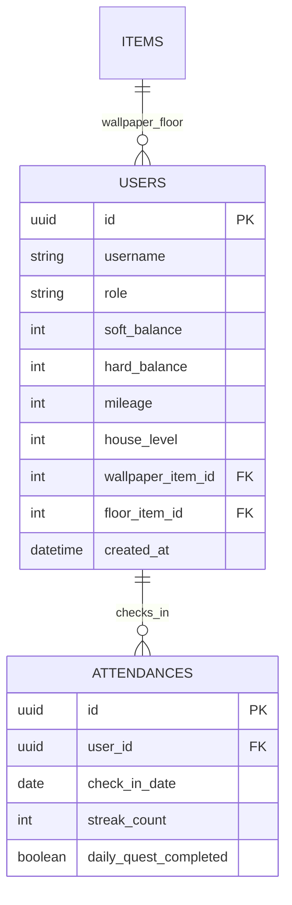
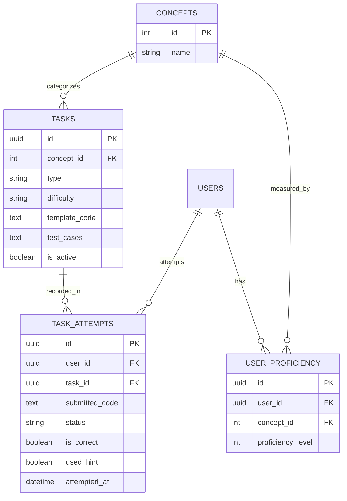
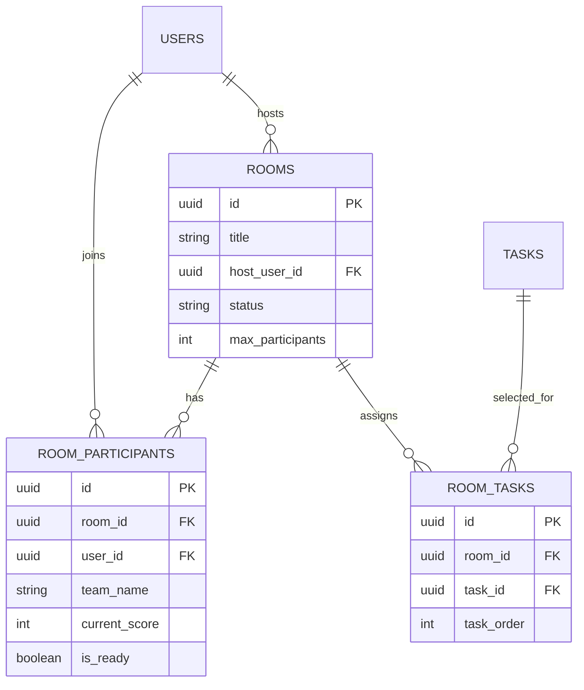
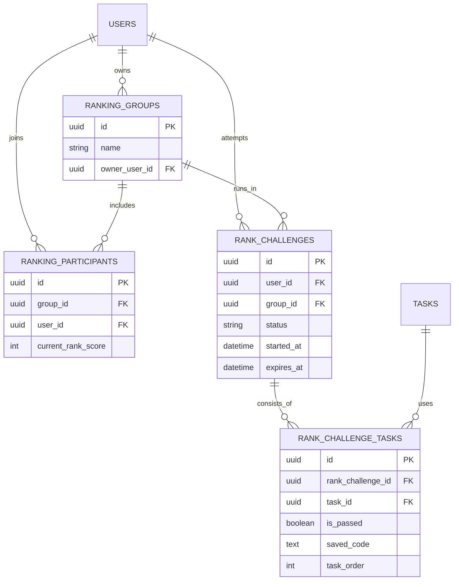
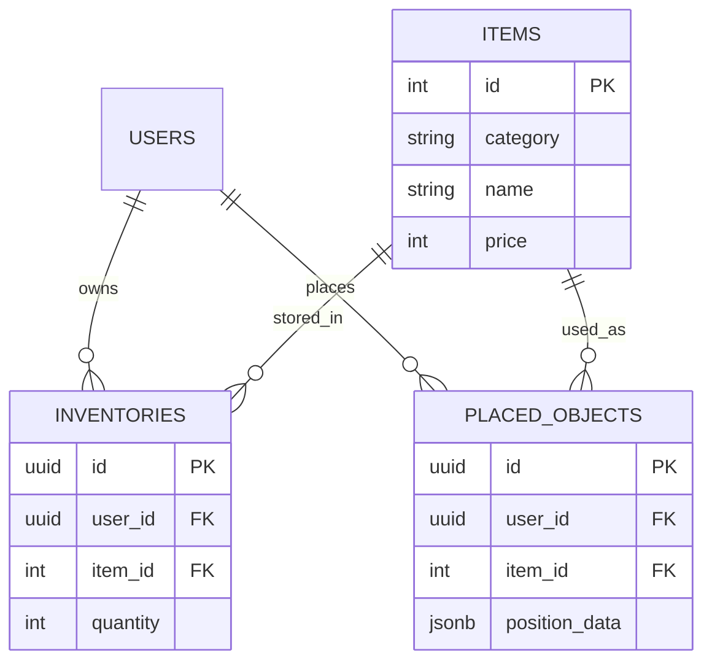
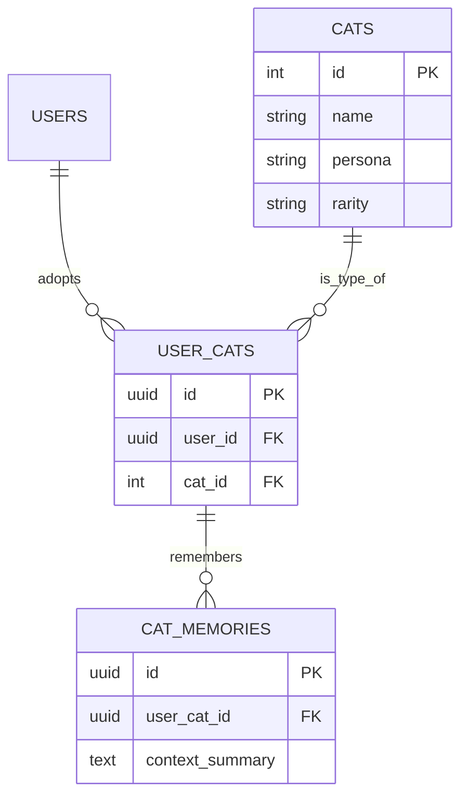

# 🐱 게임 프로젝트 ERD 분석 — Notion 정리용

> **목적**  
> 고양이 기반 Python 학습 게임의 ERD를 단순히 컬럼 목록으로 보는 것이 아니라, **각 테이블이 왜 존재하고 어떤 데이터가 흐르며 다른 테이블과 어떻게 연결되는지** 이해하기 위한 문서이다.
>
> **기준**  
> 현재 ERD의 **19개 테이블 구조를 우선 존중**한다. 동료가 작성한 분석에서 좋았던 PK/FK, `UNIQUE`, `CHECK`, 트랜잭션·동시성 관점을 반영했고, 현재 ERD와 맞지 않거나 과하게 단정된 부분은 수정했다.
>
> **읽는 방법**  
> 각 섹터마다 `미니 ERD → 테이블 역할 → 컬럼 → 관계 → 제약 → 실제 사용 → 검토 포인트` 순서로 정리했다. Notion으로 옮길 때는 섹터별 제목을 페이지/토글로 나눠도 된다.

---

# 0. 전체 ERD 한눈에 보기

## 0-1. 6개 기능 섹터

| 섹터 | 핵심 기능 | 포함 테이블 |
| --- | --- | --- |
| 👤 사용자 / 출석 | 계정, 재화, 하우스 기본 상태, 출석 | `USERS`, `ATTENDANCES` |
| 📚 학습 / 숙련도 | 개념, 문제 은행, 제출 기록, 개인화 | `CONCEPTS`, `TASKS`, `TASK_ATTEMPTS`, `USER_PROFICIENCY` |
| ⚔️ 학습방 / 배틀 | 방 생성, 참가, 팀/개인 점수, 문제 배정 | `ROOMS`, `ROOM_PARTICIPANTS`, `ROOM_TASKS` |
| 🏆 랭킹 / 도전 | 소규모 랭킹 그룹, 제한시간 도전 | `RANKING_GROUPS`, `RANKING_PARTICIPANTS`, `RANK_CHALLENGES`, `RANK_CHALLENGE_TASKS` |
| 🏠 아이템 / 하우징 | 아이템 원본, 보유 수량, 실제 배치 | `ITEMS`, `INVENTORIES`, `PLACED_OBJECTS` |
| 🐈 고양이 | 고양이 원본, 유저 보유 고양이, 기억 | `CATS`, `USER_CATS`, `CAT_MEMORIES` |

## 0-2. 서비스 전체 흐름

```text
[사용자 접속]
      │
      ▼
   USERS ───────────────→ ATTENDANCES
      │
      ▼
[문제 선택 / 추천]
      │
      ▼
CONCEPTS ─→ TASKS ─→ TASK_ATTEMPTS
    │                     │
    └────→ USER_PROFICIENCY ←┘
                │
                ▼
       [다음 문제 개인화]
                │
                ▼
           [학습 보상]
                │
       ┌────────┴────────┐
       ▼                 ▼
    ITEMS               CATS
       │                 │
 INVENTORIES          USER_CATS
       │                 │
PLACED_OBJECTS       CAT_MEMORIES
```

> 💡 **핵심**  
> 이 ERD는 `학습 DB`와 `게임 DB`가 따로 노는 구조가 아니다. 사용자가 문제를 풀면 `TASK_ATTEMPTS`에 기록이 쌓이고, 그 결과를 `USER_PROFICIENCY`에 반영해 다음 문제를 개인화한다. 학습 성과는 `USERS`의 재화와 연결되고, 재화는 아이템·하우징·고양이 수집으로 이어진다.

---

# 0-3. PK / FK / UNIQUE를 먼저 이해하기

## PK — Primary Key

각 테이블의 `id`는 **그 테이블 안의 한 행(row)을 고유하게 구분하는 기본키**이다.

예를 들어:

- `TASKS.id` → 문제 1개를 식별
- `TASK_ATTEMPTS.id` → 제출 시도 1회를 식별
- `USER_CATS.id` → 특정 유저가 소유한 고양이 기록 1건을 식별

서로 다른 테이블의 `id` 값은 같아도 상관없다. `USERS.id = 1`, `TASKS.id = 1`이어도 두 값은 서로 다른 테이블의 키이다.

## 왜 `(user_id, concept_id)` 같은 복합키 대신 `id`를 또 두나?

`USER_PROFICIENCY`처럼 `(user_id, concept_id)`만으로도 행을 구분할 수 있는 테이블이 있다. 그래도 별도의 `id`를 두면 다른 테이블이 참조하기 쉽고, 향후 관계가 추가될 때 구조가 단순해진다.

즉 현재 ERD는 대체로:

> **단일 대리키(surrogate key) `id`를 PK로 사용하고, 업무상 중복되면 안 되는 조합은 `UNIQUE`로 막는 방식**

으로 이해하면 된다.

## FK — Foreign Key

다른 테이블의 PK를 가리키는 키이다.

예:

```text
TASK_ATTEMPTS.user_id ──→ USERS.id
TASK_ATTEMPTS.task_id ──→ TASKS.id
```

덕분에 제출 기록에 사용자 이름과 문제 내용을 통째로 복사하지 않고도 원본 데이터를 찾아갈 수 있다.

---

# 1. 👤 사용자 / 출석 섹터

## 미니 ERD



```text
ITEMS ─────┐
           │ 현재 벽지 / 바닥
           ▼
        USERS
           │ 1:N
           ▼
     ATTENDANCES
```

---

## 1-1. `USERS`

### 한 줄 역할

**사용자가 누구인지와 현재 게임 상태가 무엇인지를 저장하는 ERD의 중심 테이블.**

### 왜 필요한가?

사용자 닉네임과 권한뿐 아니라 현재 보유 재화, 마일리지, 하우스 레벨, 적용 중인 벽지와 바닥처럼 **사용자에게 직접 귀속되는 현재 상태값**을 한곳에서 관리한다.

> “이 사용자는 누구이고, 지금 무엇을 얼마나 가지고 있으며 어떤 집 상태를 사용하고 있는가?”

### 주요 컬럼

| 컬럼 | 타입 | 의미 |
| --- | --- | --- |
| `id` | uuid, PK | 사용자 고유 식별자 |
| `username` | string | 사용자 이름 또는 닉네임 |
| `role` | string | 학습자/교육 담당자/운영자 등 권한 |
| `soft_balance` | int | 일반 학습 재화 |
| `hard_balance` | int | 특수 재화 |
| `mileage` | int | 중복 뽑기 보상 등에 쓰는 마일리지 |
| `house_level` | int | 사용자 하우스 레벨 |
| `wallpaper_item_id` | int, FK | 현재 적용한 벽지 (`ITEMS.id`) |
| `floor_item_id` | int, FK | 현재 적용한 바닥 (`ITEMS.id`) |
| `created_at` | datetime | 계정 생성 시각 |

### 다른 테이블과의 관계

`USERS`는 대부분의 사용자 행동 데이터의 출발점이다.

```text
USERS
 ├─ ATTENDANCES
 ├─ TASK_ATTEMPTS
 ├─ USER_PROFICIENCY
 ├─ ROOMS (host_user_id)
 ├─ ROOM_PARTICIPANTS
 ├─ RANKING_GROUPS (owner_user_id)
 ├─ RANKING_PARTICIPANTS
 ├─ RANK_CHALLENGES
 ├─ INVENTORIES
 ├─ PLACED_OBJECTS
 └─ USER_CATS
```

### 필요한 제약

```sql
CHECK (soft_balance >= 0)
CHECK (hard_balance >= 0)
CHECK (mileage >= 0)
```

재화가 음수가 되는 상황을 애플리케이션 코드뿐 아니라 DB 수준에서도 막는 것이 안전하다.

### 실제 사용 예

| 컬럼 | 예시 |
| --- | --- |
| `id` | `user-001` |
| `username` | `cat_coder` |
| `role` | `USER` |
| `soft_balance` | `1250` |
| `hard_balance` | `30` |
| `mileage` | `450` |
| `house_level` | `3` |
| `wallpaper_item_id` | `21` |
| `floor_item_id` | `34` |
| `created_at` | `2026-08-01 14:30` |

### 설계 포인트

- 닉네임 같은 사용자 정보를 다른 테이블에 반복 저장하지 않고 `user_id`로 연결한다.
- 벽지/바닥은 일반 가구와 달리 위치 좌표가 필요 없으므로 `PLACED_OBJECTS`가 아니라 `USERS`가 현재 적용값을 직접 가리키는 구조이다.
- 현재 ERD에는 **재화 변동 이력**이 없다. MVP에서는 잔액만 관리할 수 있지만, 추후 지급·차감 감사 로그가 필요하면 별도 거래 이력 테이블을 고려해야 한다.

---

## 1-2. `ATTENDANCES`

### 한 줄 역할

**사용자의 날짜별 출석, 연속 출석일수, 일일 미션 완료 상태를 저장한다.**

### 주요 컬럼

| 컬럼 | 타입 | 의미 |
| --- | --- | --- |
| `id` | uuid, PK | 출석 기록 1건의 식별자 |
| `user_id` | uuid, FK | 출석한 사용자 (`USERS.id`) |
| `check_in_date` | date | 출석 날짜 |
| `streak_count` | int | 해당 날짜 기준 연속 출석 일수 |
| `daily_quest_completed` | boolean | 그날 일일 미션 완료 여부 |

### 관계

```text
USERS 1 ───── N ATTENDANCES
```

한 사용자는 여러 날짜의 출석 기록을 가진다.

### 꼭 필요한 제약

```sql
UNIQUE (user_id, check_in_date)
CHECK (streak_count >= 0)
```

같은 사용자가 같은 날짜에 출석 행을 여러 개 만드는 것을 막는다.

### 실제 흐름

```text
8/28 로그인 → streak_count = 5
8/29 로그인 → streak_count = 6
8/30 로그인 → streak_count = 7
               daily_quest_completed = false
미션 완료     → daily_quest_completed = true
```

### 구현 주의

`daily_quest_completed = true` 값만 있다고 해서 동시 요청에 의한 중복 보상이 자동으로 막히는 것은 아니다. 보상 지급과 완료 상태 변경은 **같은 트랜잭션 또는 원자적 업데이트**로 처리해야 한다.

---

# 2. 📚 학습 / 숙련도 섹터

## 미니 ERD



```text
              CONCEPTS
              /      \
             /        \
            ▼          ▼
         TASKS    USER_PROFICIENCY
            │          ▲
            ▼          │ 결과 반영
      TASK_ATTEMPTS ───┘
            ▲
            │
          USERS
```

> 💡 `TASK_ATTEMPTS → USER_PROFICIENCY`는 직접 FK 관계라기보다 **서비스 로직상 결과를 반영하는 흐름**이다.

---

## 2-1. `CONCEPTS`

### 한 줄 역할

**Python 학습 내용을 반복문, 조건문, 리스트 등 개념 단위로 분류하는 기준표.**

### 주요 컬럼

| 컬럼 | 타입 | 의미 |
| --- | --- | --- |
| `id` | int, PK | 학습 개념 ID |
| `name` | string | 개념 이름 |

### 왜 따로 두나?

문제마다 `"반복문"`, `"for문"`, `"loop"` 같은 문자열을 직접 넣으면 같은 개념이 여러 표현으로 갈라질 수 있다. `CONCEPTS`를 마스터 테이블로 두면 문제 분류와 숙련도 계산이 같은 기준을 사용한다.

### 추천 제약

```sql
UNIQUE (name)
```

개념 이름 중복을 막는다.

### ⚠️ 현재 구조의 한계

현재 `TASKS`에는 `concept_id`가 **하나만** 있다. 따라서 한 문제를 하나의 대표 개념에만 연결할 수 있다.

하지만 실제 코딩 문제는:

```python
for x in numbers:
    if x > 0:
        ...
```

처럼 반복문 + 조건문 + 리스트가 동시에 사용될 수 있다.

정석적인 확장 구조는:

```text
TASKS N ── TASK_CONCEPTS ── N CONCEPTS
```

이다.

현재 19개 테이블 제한을 유지해야 한다면 MVP 정책은 다음처럼 정할 수 있다.

> **한 문제에는 학습 목표가 되는 대표 개념 하나만 지정한다.**

---

## 2-2. `TASKS`

### 한 줄 역할

**사용자가 풀 문제의 원본 데이터와 자동 채점 기준을 보관하는 문제 은행.**

### 주요 컬럼

| 컬럼 | 타입 | 의미 |
| --- | --- | --- |
| `id` | uuid, PK | 문제 고유 ID |
| `concept_id` | int, FK | 대표 학습 개념 (`CONCEPTS.id`) |
| `type` | string | 문제 유형: 퀴즈, 코드 작성형 등 |
| `difficulty` | string | 난이도 |
| `template_code` | text | 사용자에게 제공할 기본 코드 골격 |
| `test_cases` | text | 결정론적 자동 채점용 테스트 데이터 |
| `is_active` | boolean | 현재 출제 가능 여부 |

### 역할 구분

```text
TASKS          = 문제 원본
TASK_ATTEMPTS  = 사용자가 실제로 제출한 기록
```

`TASKS`에는 “누가 풀었는지”를 저장하지 않는다.

### `is_active`가 필요한 이유

오류가 있는 문제를 실제 DB에서 삭제하면 과거 `TASK_ATTEMPTS`가 가리키던 문제와 연결이 깨질 수 있다. 그래서 문제를 물리적으로 삭제하기보다 비활성화하여 신규 출제만 막는 **소프트 딜리트 성격**으로 사용할 수 있다.

### `template_code`와 보안

`template_code`는 함수 이름·매개변수·기본 구조를 고정해 **일관된 채점 형식**을 만드는 데 도움이 된다.

하지만 악성 코드 실행을 막는 보안 장치 자체는 아니다. 실제 보안은 Docker/샌드박스에서 다음을 제한해야 한다.

- 실행 시간
- CPU / 메모리
- 네트워크
- 파일 시스템
- 프로세스 생성
- 출력 크기

### 검토 포인트

- `type`, `difficulty`는 허용값을 Enum 또는 `CHECK`로 제한하면 오타를 줄일 수 있다.
- `test_cases`가 단순 text인지 JSON 구조인지 백엔드 구현 전에 형식을 확정하는 것이 좋다.
- 문제 설명/선택지/힌트/해설을 실제 DB에서 관리한다면 현재 컬럼만으로 충분한지 추가 검토가 필요하다.

---

## 2-3. `TASK_ATTEMPTS`

### 한 줄 역할

**누가 어떤 문제를 어떤 코드로 언제 제출했고 결과가 어땠는지를 기록하는 학습 이력 테이블.**

### 주요 컬럼

| 컬럼 | 타입 | 의미 |
| --- | --- | --- |
| `id` | uuid, PK | 제출 시도 1회의 고유 ID |
| `user_id` | uuid, FK | 제출 사용자 (`USERS.id`) |
| `task_id` | uuid, FK | 제출한 문제 (`TASKS.id`) |
| `submitted_code` | text | 실제 제출 코드 |
| `status` | string | 채점 처리 상태 |
| `is_correct` | boolean | 정답 여부 |
| `used_hint` | boolean | 힌트 사용 여부 |
| `attempted_at` | datetime | 제출 시각 |

### 같은 문제를 여러 번 풀어도 되는 이유

이 게임은 오답 재시도를 허용하므로 다음처럼 **같은 user + task 조합의 행이 여러 개 존재하는 것이 정상**이다.

```text
민지 / TASK-101
1차 → 오답 / 힌트 X
2차 → 오답 / 힌트 O
3차 → 정답 / 힌트 O
```

따라서 `(user_id, task_id)`에 UNIQUE를 두면 안 된다.

### 무엇에 쓰나?

- 최초 정답 여부 판별
- 정답까지 걸린 시도 횟수
- 최근 성취 변화
- 힌트 사용 패턴
- 취약 문제 분석
- `USER_PROFICIENCY` 갱신 근거

### 보상 중복 방지와의 관계

과거 정답 기록을 조회하면 “이미 이 문제를 완료했는가?”를 판단할 수 있다. 다만 동시에 정답 요청이 두 번 들어올 가능성까지 완벽히 막으려면 **보상 지급 로직에 트랜잭션/락/원자적 처리**가 필요하다.

### ⚠️ 현재 ERD와 설명을 맞출 때 주의

현재 테이블에는 `feedback`, `error_message` 컬럼이 없다. 따라서 현재 ERD 기준으로는 **제출 코드와 채점 상태/결과를 저장한다**고 설명하는 것이 정확하다.

피드백까지 영구 저장하려면 별도 컬럼 추가 검토가 필요하다.

---

## 2-4. `USER_PROFICIENCY`

### 한 줄 역할

**사용자마다 각 Python 개념을 얼마나 잘하는지 현재 숙련도 값을 저장한다.**

### 주요 컬럼

| 컬럼 | 타입 | 의미 |
| --- | --- | --- |
| `id` | uuid, PK | 숙련도 행 식별자 |
| `user_id` | uuid, FK | 사용자 |
| `concept_id` | int, FK | 학습 개념 |
| `proficiency_level` | int | 해당 개념의 현재 숙련도 |

### 관계

```text
USERS N ── USER_PROFICIENCY ── N CONCEPTS
```

예:

| 사용자 | 개념 | 숙련도 |
| --- | --- | ---: |
| 민지 | 변수 | 5 |
| 민지 | 조건문 | 4 |
| 민지 | 반복문 | 2 |
| 민지 | 함수 | 1 |

### 꼭 필요한 제약

```sql
UNIQUE (user_id, concept_id)
```

한 사용자가 같은 개념에 숙련도 행을 두 개 가지지 않도록 한다.

### `TASK_ATTEMPTS`와 차이

```text
TASK_ATTEMPTS      = 과거에 실제로 무엇을 했는가? (이력)
USER_PROFICIENCY   = 이력을 종합한 현재 실력이 얼마인가? (상태)
```

### 정책 결정 필요

`proficiency_level`은 현재 숫자만 있고 의미가 아직 부족하다. 다음을 팀에서 정해야 한다.

- 몇 점/몇 레벨 만점인가?
- 정답 시 얼마나 오르는가?
- 오답 시 내려가는가?
- 힌트 사용 시 가중치가 다른가?
- 시간이 오래 지나면 감소시키는가?

이 규칙이 문제 추천 알고리즘의 핵심이 된다.

---

# 3. ⚔️ 학습방 / 배틀 섹터

## 미니 ERD



```text
                USERS
               /     \
       방장   /       \ 참가
            ▼         ▼
          ROOMS ─→ ROOM_PARTICIPANTS
            │
            │ 문제 목록
            ▼
        ROOM_TASKS
            │
            ▼
           TASKS
```

---

## 3-1. `ROOMS`

### 한 줄 역할

**실시간 학습 배틀 한 판을 묶는 방 자체의 정보와 상태를 관리한다.**

### 주요 컬럼

| 컬럼 | 타입 | 의미 |
| --- | --- | --- |
| `id` | uuid, PK | 방 고유 ID |
| `title` | string | 로비에 보이는 방 제목 |
| `host_user_id` | uuid, FK | 방장 (`USERS.id`) |
| `status` | string | `WAITING`, `IN_PROGRESS`, `FINISHED` |
| `max_participants` | int | 최대 참가 인원 |

### 왜 참가자 수를 직접 저장하지 않나?

현재 참가 인원은 `ROOM_PARTICIPANTS`에서 해당 `room_id`의 행 수를 세어 계산할 수 있다.

`ROOMS.current_participants` 같은 중복 컬럼을 또 두면 사용자가 입·퇴장할 때 값이 어긋날 위험이 있다.

### 동시성 주의

여러 명이 동시에 마지막 자리에 입장하면 최대 인원을 넘길 수 있다. 따라서 입장 시점에는 **동시성 제어**가 필요하다. 구현 방식은 DB lock, 조건부 업데이트, 별도 상태 저장소 등으로 선택할 수 있다.

### 추천 제약

```sql
CHECK (max_participants > 0)
```

`status`는 허용값을 Enum/CHECK로 제한하는 것이 좋다.

---

## 3-2. `ROOM_PARTICIPANTS`

### 한 줄 역할

**어떤 사용자가 어떤 방에 참가했으며 팀, 현재 점수, 준비 상태가 무엇인지 저장한다.**

### 주요 컬럼

| 컬럼 | 타입 | 의미 |
| --- | --- | --- |
| `id` | uuid, PK | 방 참가 기록 ID |
| `room_id` | uuid, FK | 참가한 방 (`ROOMS.id`) |
| `user_id` | uuid, FK | 참가 사용자 (`USERS.id`) |
| `team_name` | string, nullable | 팀 이름. 개인전이면 `NULL` |
| `current_score` | int | 해당 방에서 현재 얻은 점수 |
| `is_ready` | boolean | 게임 시작 준비 여부 |

### 왜 중간 테이블이 필요한가?

한 방에는 여러 사용자가 들어오고, 한 사용자도 시간이 지나 여러 방에 참가할 수 있으므로 `ROOMS ↔ USERS`는 다대다 관계이다.

### 꼭 필요한 제약

```sql
UNIQUE (room_id, user_id)
```

같은 사용자가 같은 방에 참가자 행을 두 개 만들지 못하게 한다.

### 팀전 처리

별도의 `TEAMS` 테이블 없이 `team_name`으로 묶고:

```text
RED  : A 20점 + B 30점 = 50점
BLUE : C 25점 + D 40점 = 65점
```

처럼 참가자 점수를 합산할 수 있다.

MVP에서는 단순하지만, 팀 자체에 추가 정보가 많아진다면 향후 팀 테이블 분리가 필요할 수 있다.

---

## 3-3. `ROOM_TASKS`

### 한 줄 역할

**특정 방에서 어떤 문제를 어떤 순서로 출제할지 미리 고정하는 연결 테이블.**

### 주요 컬럼

| 컬럼 | 현재 ERD 타입 | 의미 |
| --- | --- | --- |
| `id` | uuid, PK | 방-문제 연결 기록 ID |
| `room_id` | uuid, FK | 문제를 사용할 방 |
| `task_id` | uuid, FK | 출제할 문제 |
| `task_order` | **uuid로 표시됨** | 방 내부 문제 순서 |

### 왜 필요한가?

`ROOMS`에 `task_id` 하나만 두면 한 방에 문제 하나밖에 연결하지 못한다. `ROOM_TASKS`를 사용하면 한 방에 여러 문제를 넣고 순서를 고정할 수 있다.

```text
ROOM-100
1번 → TASK-25
2번 → TASK-31
3번 → TASK-18
```

### 🚨 확정 수정 후보

현재 ERD 그림의 `ROOM_TASKS.task_order`는 `uuid`로 표시되어 있다. 순서값은 `1, 2, 3...`처럼 정수여야 하므로 **`int`가 자연스럽다.**

```text
현재 : task_order uuid
권장 : task_order int
```

`RANK_CHALLENGE_TASKS.task_order`도 이미 `int`이므로 타입을 통일하는 것이 좋다.

### 추천 제약

```sql
UNIQUE (room_id, task_order)
CHECK (task_order > 0)
```

같은 방에서 2번 문제가 두 개 생기는 것을 막는다.

---

# 4. 🏆 랭킹 / 도전 섹터

## 미니 ERD



```text
           RANKING_GROUPS
              /      \
             /        \
            ▼          ▼
RANKING_PARTICIPANTS  RANK_CHALLENGES
          ▲                  │
          │                  ▼
        USERS       RANK_CHALLENGE_TASKS
                             │
                             ▼
                            TASKS
```

---

## 4-1. `RANKING_GROUPS`

### 한 줄 역할

**전체 글로벌 랭킹이 아니라 반/친구/그룹 단위의 소규모 랭킹보드를 정의한다.**

### 주요 컬럼

| 컬럼 | 타입 | 의미 |
| --- | --- | --- |
| `id` | uuid, PK | 랭킹 그룹 ID |
| `name` | string | 그룹 이름 |
| `owner_user_id` | uuid, FK | 그룹 생성자/소유자 (`USERS.id`) |

### 실제 예

```text
1분반
2분반
프로젝트 1조
반복문 챌린지 그룹
```

### 검토 포인트

`owner_user_id`가 실제로 어떤 권한을 갖는지 정책이 필요하다.

- 멤버 초대/삭제 가능?
- 그룹 이름 수정 가능?
- 그룹 삭제 가능?
- 교육 담당자가 자동 생성하는 그룹에도 owner가 필요한가?

---

## 4-2. `RANKING_PARTICIPANTS`

### 한 줄 역할

**특정 랭킹 그룹에 어떤 사용자가 속해 있고 현재 랭킹 점수가 얼마인지 저장한다.**

### 주요 컬럼

| 컬럼 | 타입 | 의미 |
| --- | --- | --- |
| `id` | uuid, PK | 참가 기록 ID |
| `group_id` | uuid, FK | 랭킹 그룹 |
| `user_id` | uuid, FK | 참가 사용자 |
| `current_rank_score` | int | 해당 그룹에서의 현재 점수 |

### 꼭 필요한 제약

```sql
UNIQUE (group_id, user_id)
```

같은 사용자가 같은 랭킹 그룹에 두 번 등록되는 것을 막는다.

### 왜 점수를 `USERS`에 넣지 않나?

사용자 한 명이 여러 그룹에 참가할 수 있고 그룹마다 점수가 다를 수 있기 때문이다.

```text
민지
├─ 1분반 랭킹 : 1,520
├─ 친구 랭킹  :   800
└─ 특별 그룹  :   430
```

---

## 4-3. `RANK_CHALLENGES`

### 한 줄 역할

**사용자가 랭킹 점수를 얻기 위해 시작한 한 번의 제한시간 도전 세션 전체를 저장한다.**

### 주요 컬럼

| 컬럼 | 타입 | 의미 |
| --- | --- | --- |
| `id` | uuid, PK | 도전 세션 ID |
| `user_id` | uuid, FK | 도전 사용자 |
| `group_id` | uuid, FK | 대상 랭킹 그룹 |
| `status` | string | `IN_PROGRESS`, `SUCCESS`, `FAILED`, `TIMEOUT` |
| `started_at` | datetime | 도전 시작 시각 |
| `expires_at` | datetime | 절대 기준 만료 시각 |

### `expires_at`이 중요한 이유

클라이언트에 단순히 “10분 남음”만 저장하면 새로고침이나 재접속 시 기준이 흔들릴 수 있다.

```text
started_at = 15:20
expires_at = 15:30
현재 15:27 → 3분 남음
현재 15:32 → TIMEOUT
```

처럼 서버가 절대 시각을 기준으로 판단할 수 있다.

### 추천 제약

```sql
CHECK (expires_at > started_at)
```

`status`는 허용값을 Enum/CHECK로 제한한다.

---

## 4-4. `RANK_CHALLENGE_TASKS`

### 한 줄 역할

**한 번의 랭크 도전에 포함된 각 문제의 순서, 통과 여부, 이어하기 코드를 저장한다.**

### 주요 컬럼

| 컬럼 | 타입 | 의미 |
| --- | --- | --- |
| `id` | uuid, PK | 도전-문제 기록 ID |
| `rank_challenge_id` | uuid, FK | 소속 도전 (`RANK_CHALLENGES.id`) |
| `task_id` | uuid, FK | 실제 문제 (`TASKS.id`) |
| `is_passed` | boolean | 해당 문제 통과 여부 |
| `saved_code` | text | 문제 이동/재접속을 위한 임시 코드 |
| `task_order` | int | 도전 내 문제 순서 |

### `TASK_ATTEMPTS`와 차이

```text
RANK_CHALLENGE_TASKS = 현재 도전 안에서 문제 진행 상태
TASK_ATTEMPTS        = 실제 제출이 발생한 학습 이력
```

사용자가 문제를 아직 제출하지 않고 작성 중이라면 `saved_code`만 존재할 수 있다.

### 추천 제약

```sql
UNIQUE (rank_challenge_id, task_order)
CHECK (task_order > 0)
```

### 문서 표기 통일

동료 분석 문서에서는 `challenge_id`라는 표현이 있었지만 **현재 ERD 컬럼명은 `rank_challenge_id`**이므로 구현/문서 모두 이 이름으로 통일하는 것이 좋다.

---

# 5. 🏠 아이템 / 하우징 섹터

## 미니 ERD



```text
                    ITEMS
                 /    |    \
                /     |     \
    벽지/바닥 ▼      ▼      ▼ 가구
             USERS  INVENTORIES
               │       ▲
               │       │ 보유
               ▼       │
          PLACED_OBJECTS
          실제 집에 배치
```

---

## 5-1. `ITEMS`

### 한 줄 역할

**게임에 존재하는 가구·벽지·바닥 등 아이템 종류 자체의 원본 정보를 저장한다.**

### 주요 컬럼

| 컬럼 | 타입 | 의미 |
| --- | --- | --- |
| `id` | int, PK | 아이템 종류 ID |
| `category` | string | `WALLPAPER`, `FLOOR`, `FURNITURE` 등 |
| `name` | string | 표시 이름 |
| `price` | int | 구매 가격 |

### `ITEMS`와 `INVENTORIES` 차이

```text
ITEMS       : 파란 소파라는 상품이 존재하고 가격은 500이다.
INVENTORIES : 민지가 파란 소파를 2개 가지고 있다.
```

즉 `ITEMS`는 **마스터 데이터**, `INVENTORIES`는 **개인 소유 상태**다.

### 추천 제약

```sql
CHECK (price >= 0)
```

### 정책 결정 필요 — `currency_type`

현재 `ITEMS`에는 가격 숫자만 있고 어떤 재화로 구매하는지는 없다.

상점에서 모든 아이템을 `soft_balance` 하나로만 산다면 현재 구조로 충분하다. 하지만:

```text
소파       → soft 500
특별 벽지  → hard 10
```

처럼 여러 재화를 사용한다면 `currency_type` 컬럼이 필요하다.

> **확정 수정이 아니라 상점 정책이 결정된 뒤 추가할 컬럼이다.**

---

## 5-2. `INVENTORIES`

### 한 줄 역할

**어떤 사용자가 어떤 아이템을 몇 개 보유하고 있는지 저장한다.**

### 주요 컬럼

| 컬럼 | 타입 | 의미 |
| --- | --- | --- |
| `id` | uuid, PK | 보유 기록 ID |
| `user_id` | uuid, FK | 소유 사용자 |
| `item_id` | int, FK | 보유 아이템 |
| `quantity` | int | 보유 수량 |

### 꼭 필요한 제약

```sql
UNIQUE (user_id, item_id)
CHECK (quantity >= 0)
```

한 사용자의 같은 아이템을 여러 행으로 나누지 않고 수량으로 관리한다.

### 구매 트랜잭션

아이템 구매 시:

```text
1. USERS.soft_balance 차감
2. INVENTORIES.quantity 증가
```

두 작업 중 하나만 성공하면 데이터가 망가진다. 따라서 **재화 차감과 아이템 지급은 하나의 DB 트랜잭션**으로 묶어야 한다.

---

## 5-3. `PLACED_OBJECTS`

### 한 줄 역할

**보유 아이템 중 실제로 사용자의 하우스 공간에 배치된 가구의 위치와 방향을 저장한다.**

### 주요 컬럼

| 컬럼 | 타입 | 의미 |
| --- | --- | --- |
| `id` | uuid, PK | 실제 배치 오브젝트 ID |
| `user_id` | uuid, FK | 집 주인 |
| `item_id` | int, FK | 배치된 아이템 |
| `position_data` | jsonb | x/y 좌표, 회전 등 배치 정보 |

### JSONB 예시

```json
{
  "x": 3,
  "y": 5,
  "rotation": 90
}
```

향후 필요하면:

```json
{
  "x": 3,
  "y": 5,
  "rotation": 90,
  "layer": 2,
  "flipped": false
}
```

처럼 스키마 변경 없이 확장하기 쉽다.

### `INVENTORIES`와 차이

```text
INVENTORIES   = 가지고 있다
PLACED_OBJECTS = 집에 실제로 놓았다
```

예를 들어 소파 3개를 보유하고 2개만 집에 놓을 수 있다.

### 구현 주의

FK만으로는 “이 유저가 실제로 보유한 아이템만 배치했는가?”를 완전히 보장할 수 없다. 배치 API에서 `INVENTORIES.quantity`와 현재 배치 수량을 함께 검사해야 한다.

`position_data`의 필수 키(`x`, `y`, `rotation`)와 허용 범위도 애플리케이션에서 검증해야 한다.

---

# 6. 🐈 고양이 섹터

## 미니 ERD



```text
USERS ──┐
        ├──→ USER_CATS ───→ CAT_MEMORIES
CATS ───┘
 종류        실제 소유 개체      개별 기억
```

> 💡 `CATS.id`는 고양이 **종류/원형**, `USER_CATS.id`는 특정 사용자가 실제로 가진 **보유 개체**를 식별한다.

---

## 6-1. `CATS`

### 한 줄 역할

**게임에서 획득 가능한 고양이 종류의 기본 이름, 페르소나, 희귀도를 정의하는 마스터 테이블.**

### 주요 컬럼

| 컬럼 | 타입 | 의미 |
| --- | --- | --- |
| `id` | int, PK | 고양이 종류 ID |
| `name` | string | 기본 이름/표시 이름 |
| `persona` | string | 성격과 말투의 기본 설정 |
| `rarity` | string | 희귀 등급 |

### 실제 예

```text
cat_id 1
name    주황 고양이
persona 활발하고 사람을 좋아함
rarity  COMMON
```

### `CATS`와 `USER_CATS` 차이

```text
CATS      = 게임에 '주황 고양이'라는 종류가 존재한다.
USER_CATS = 민지가 실제로 그 주황 고양이를 보유한다.
```

### 검토 포인트

- `rarity`는 허용값을 Enum/CHECK로 제한하는 것이 좋다.
- 실제 뽑기 확률은 `rarity` 문자열 자체가 아니라 백엔드 정책/설정으로 관리하는 것이 안전하다.
- 유저별 고양이 이름 변경 기능이 있다면 `CATS.name`과 별도로 `USER_CATS.nickname` 같은 컬럼이 필요하다.

---

## 6-2. `USER_CATS`

### 한 줄 역할

**특정 사용자가 실제로 획득한 고양이 보유 기록을 저장한다.**

### 주요 컬럼

| 컬럼 | 타입 | 의미 |
| --- | --- | --- |
| `id` | uuid, PK | 사용자 소유 고양이 기록 ID |
| `user_id` | uuid, FK | 소유 사용자 (`USERS.id`) |
| `cat_id` | int, FK | 고양이 원형 (`CATS.id`) |

### 왜 `id`가 중요한가?

같은 `cat_id = 1`이라도:

```text
민지의 주황 고양이 → USER_CATS.id = UC-001
철수의 주황 고양이 → USER_CATS.id = UC-928
```

는 서로 다른 사용자에게 속한 별도 개체다.

`CAT_MEMORIES`가 `cat_id`가 아니라 `user_cat_id`를 참조하는 이유도 이 때문이다.

### 현재 정책 기준 추천 제약

중복 고양이는 두 마리로 보유하지 않고 마일리지로 변환한다는 정책이라면:

```sql
UNIQUE (user_id, cat_id)
```

가 필요하다.

> 만약 나중에 같은 종류의 고양이를 여러 마리 보유할 수 있게 정책이 바뀐다면 이 UNIQUE는 제거해야 한다.

### 확장 후보

현재 `USER_CATS`는 소유 관계만 가진 매우 얇은 테이블이다. 실제 게임에서 개별 고양이를 성장시키려면 다음 컬럼이 필요할 수 있다.

- `nickname`
- `level`
- `affection`
- `acquired_at`
- 현재 행동/상태를 영구 저장할 필요가 있는지 여부

MVP 범위와 테이블 제한을 보고 결정한다.

---

## 6-3. `CAT_MEMORIES`

### 한 줄 역할

**특정 사용자가 가진 특정 고양이가 다음 대화에서 기억할 사건/사실을 요약해 저장한다.**

### 주요 컬럼

| 컬럼 | 타입 | 의미 |
| --- | --- | --- |
| `id` | uuid, PK | 기억 1건의 ID |
| `user_cat_id` | uuid, FK | 기억 주체가 되는 보유 고양이 (`USER_CATS.id`) |
| `context_summary` | text | 다음 대화에 사용할 요약 기억 |

### 왜 `cat_id`가 아닌가?

모든 주황 고양이가 같은 기억을 공유하면 안 된다.

```text
민지의 주황 고양이 → 민지와의 기억
철수의 주황 고양이 → 철수와의 기억
```

따라서 기억은 고양이 원형 `CATS`가 아니라 실제 보유 개체 `USER_CATS`에 연결된다.

### 예시

```text
"사용자는 반복문 문제를 어려워했지만 끝까지 완료했다.
새 파란 소파를 구매해 하우스에 배치했다."
```

이 요약을 다음 대화의 문맥으로 사용하면 고양이가 이전 상호작용을 기억하는 것처럼 보이게 할 수 있다.

### 🚨 강한 추가 검토 후보 — `created_at`

현재 ERD에는 기억 내용만 있고 **언제 생성된 기억인지 나타내는 시간이 없다.**

기억이 여러 개 쌓일 경우 최근 기억을 정렬하거나 오래된 기억을 정리하기 어려우므로 다음 컬럼을 검토하는 것이 좋다.

```text
created_at datetime
```

특히 “최근 문맥”을 활용하려면 시간 정보가 유용하다.

---

# 7. 19개 테이블 초압축 요약

| 번호 | 테이블 | 핵심 역할 |
| ---: | --- | --- |
| 1 | `USERS` | 사용자 계정과 현재 게임 상태 |
| 2 | `ATTENDANCES` | 날짜별 출석과 연속 출석/일일 미션 |
| 3 | `CONCEPTS` | Python 학습 개념 기준표 |
| 4 | `TASKS` | 출제 가능한 문제 원본과 채점 기준 |
| 5 | `TASK_ATTEMPTS` | 사용자의 실제 제출·채점 이력 |
| 6 | `USER_PROFICIENCY` | 사용자별·개념별 현재 숙련도 |
| 7 | `ROOMS` | 실시간 학습/배틀 방 |
| 8 | `ROOM_PARTICIPANTS` | 방 참가자, 팀, 점수, 준비 상태 |
| 9 | `ROOM_TASKS` | 방에 배정된 문제와 출제 순서 |
| 10 | `RANKING_GROUPS` | 소규모 랭킹 그룹 |
| 11 | `RANKING_PARTICIPANTS` | 그룹별 사용자 현재 랭킹 점수 |
| 12 | `RANK_CHALLENGES` | 한 번의 제한시간 랭크 도전 세션 |
| 13 | `RANK_CHALLENGE_TASKS` | 도전 안의 문제별 진행 상태/임시 코드 |
| 14 | `ITEMS` | 아이템 종류의 원본 정보 |
| 15 | `INVENTORIES` | 사용자별 아이템 보유 수량 |
| 16 | `PLACED_OBJECTS` | 하우스에 실제 배치된 가구 위치 |
| 17 | `CATS` | 고양이 종류·페르소나·희귀도 |
| 18 | `USER_CATS` | 사용자가 실제로 보유한 고양이 |
| 19 | `CAT_MEMORIES` | 보유 고양이별 대화 기억 요약 |

---

# 8. 데이터가 실제로 흐르는 예시

## 시나리오 A — 문제를 풀고 숙련도가 올라가는 과정

```text
1. 사용자 로그인
   USERS 확인

2. 추천 문제 요청
   USER_PROFICIENCY 조회
        ↓
   부족한 CONCEPT 확인
        ↓
   TASKS에서 적절한 난이도 선택

3. 사용자 코드 제출
   TASK_ATTEMPTS 생성
        ↓
   채점 서버에서 TASKS.test_cases 실행
        ↓
   status / is_correct 저장

4. 결과 반영
   USER_PROFICIENCY 갱신

5. 최초 완료라면
   USERS.soft_balance 보상 지급
```

## 시나리오 B — 가구 구매 후 하우스에 배치

```text
ITEMS에서 소파 선택
        ↓
USERS 재화 충분한지 확인
        ↓
[한 트랜잭션]
  재화 차감
  INVENTORIES 수량 증가
        ↓
배치 요청
        ↓
보유 수량 검증
        ↓
PLACED_OBJECTS 생성
```

## 시나리오 C — 고양이를 뽑고 대화 기억이 생김

```text
뽑기 결과 → CATS.id 결정
        ↓
이미 보유?
 ├─ YES → mileage 지급
 └─ NO  → USER_CATS 생성
                 ↓
             고양이 대화
                 ↓
          CAT_MEMORIES 저장
                 ↓
       다음 대화에서 문맥으로 사용
```

## 시나리오 D — 랭킹 도전

```text
RANKING_GROUPS 참가
        ↓
RANKING_PARTICIPANTS 존재
        ↓
RANK_CHALLENGES 생성
started_at / expires_at 확정
        ↓
RANK_CHALLENGE_TASKS 문제 목록 생성
        ↓
작성 중 saved_code 저장
        ↓
문제 제출 → TASK_ATTEMPTS
        ↓
모두 통과 / 시간 초과 판단
        ↓
RANK_CHALLENGES.status 변경
        ↓
RANKING_PARTICIPANTS.current_rank_score 반영
```

---

# 9. 반드시 구분해야 하는 헷갈리는 테이블들

## `TASKS` vs `TASK_ATTEMPTS`

```text
TASKS         = 문제지 원본
TASK_ATTEMPTS = 학생이 제출한 답안 기록
```

## `TASK_ATTEMPTS` vs `USER_PROFICIENCY`

```text
TASK_ATTEMPTS    = 과거 행동 이력
USER_PROFICIENCY = 이력을 종합한 현재 실력 상태
```

## `ITEMS` vs `INVENTORIES` vs `PLACED_OBJECTS`

```text
ITEMS          = 게임에 어떤 물건이 존재하는가
INVENTORIES    = 내가 무엇을 몇 개 가지고 있는가
PLACED_OBJECTS = 그중 무엇을 집 어디에 놓았는가
```

## `CATS` vs `USER_CATS` vs `CAT_MEMORIES`

```text
CATS         = 고양이 원형/종류
USER_CATS    = 내가 실제로 가진 고양이
CAT_MEMORIES = 그 고양이와 나 사이에 생긴 기억
```

## `RANK_CHALLENGES` vs `RANK_CHALLENGE_TASKS`

```text
RANK_CHALLENGES      = 시험 한 판 전체
RANK_CHALLENGE_TASKS = 그 시험 안의 각 문제 상태
```

---

# 10. ERD 수정 / 팀 논의 포인트

## 🚨 A. 현재 ERD에서 수정 우선순위가 높은 부분

### 1) `ROOM_TASKS.task_order` 타입

```text
현재 ERD : uuid
권장     : int
```

순서값이므로 정수 타입이 맞다.

### 2) 문서 컬럼명 통일

`RANK_CHALLENGE_TASKS`의 FK는 현재 ERD 기준:

```text
rank_challenge_id
```

로 통일한다.

### 3) `CAT_MEMORIES.created_at` 검토

기억의 최신순 정렬/삭제 정책을 위해 생성 시각이 필요할 가능성이 높다.

---

## 🟡 B. 팀 정책을 정해야 결정할 수 있는 부분

### 1) 한 문제에 여러 개념을 허용할 것인가?

현재는 `TASKS.concept_id` 하나뿐이다.

- MVP: 대표 개념 하나만 사용
- 확장: `TASK_CONCEPTS` 중간 테이블 추가

### 2) 아이템 구매에 어떤 재화를 사용할 것인가?

- 일반 재화만 → 현재 `price`로 충분
- 여러 재화 → `currency_type` 필요

### 3) 개별 고양이 성장 요소를 DB에 저장할 것인가?

필요 시 `USER_CATS`에:

```text
nickname
level
affection
acquired_at
```

등을 추가한다.

### 4) 숙련도 계산 규칙

`USER_PROFICIENCY.proficiency_level`의 범위와 증감 공식을 확정해야 한다.

### 5) TASK 피드백을 영구 저장할 것인가?

현재 `TASK_ATTEMPTS`에는 에러 메시지/피드백 컬럼이 없다.

---

## 🟢 C. 현재 구조에서 잘 잡힌 부분

- `TASKS`와 `TASK_ATTEMPTS` 분리
- `TASK_ATTEMPTS`와 `USER_PROFICIENCY` 분리
- 방 참가자를 `ROOM_PARTICIPANTS`로 분리
- 방 문제를 `ROOM_TASKS`로 분리
- 랭킹 그룹과 도전 세션 분리
- `ITEMS` / `INVENTORIES` / `PLACED_OBJECTS` 3단 분리
- `CATS` / `USER_CATS` / `CAT_MEMORIES` 3단 분리
- 벽지/바닥과 좌표 기반 가구의 저장 방식 분리
- 제한시간을 남은 초가 아닌 `expires_at` 절대시간으로 저장

---

# 11. DB 제약조건 체크리스트

| 테이블 | 권장 제약 |
| --- | --- |
| `USERS` | `CHECK balances >= 0` |
| `ATTENDANCES` | `UNIQUE(user_id, check_in_date)` |
| `CONCEPTS` | `UNIQUE(name)` 검토 |
| `TASKS` | type/difficulty 허용값 제한 |
| `USER_PROFICIENCY` | `UNIQUE(user_id, concept_id)` |
| `ROOMS` | `CHECK(max_participants > 0)` |
| `ROOM_PARTICIPANTS` | `UNIQUE(room_id, user_id)` |
| `ROOM_TASKS` | `UNIQUE(room_id, task_order)` |
| `RANKING_PARTICIPANTS` | `UNIQUE(group_id, user_id)` |
| `RANK_CHALLENGES` | `CHECK(expires_at > started_at)` |
| `RANK_CHALLENGE_TASKS` | `UNIQUE(rank_challenge_id, task_order)` |
| `ITEMS` | `CHECK(price >= 0)` |
| `INVENTORIES` | `UNIQUE(user_id, item_id)`, `CHECK(quantity >= 0)` |
| `USER_CATS` | 현재 중복→마일리지 정책이면 `UNIQUE(user_id, cat_id)` |

---

# 12. 백엔드 구현 시 특히 조심할 부분

## 1) 재화 지급/차감은 트랜잭션

다음처럼 두 테이블 이상을 같이 바꾸는 작업은 한 트랜잭션으로 묶는 것이 중요하다.

```text
문제 보상 지급
아이템 구매
고양이 중복 마일리지 지급
랭킹 점수 반영
```

## 2) 방 입장에는 동시성 제어

`max_participants = 4`인 방에 동시에 여러 사용자가 들어올 경우 정원 초과가 발생하지 않도록 해야 한다.

## 3) 코드 채점은 DB와 별개로 격리

`TASKS.template_code`는 보안 샌드박스가 아니다. 사용자 Python 코드는 제한된 실행 환경에서 돌려야 한다.

## 4) FK 삭제 정책 결정

예를 들어 문제를 삭제할 때 과거 제출 기록까지 지워지면 안 될 수 있다. 따라서 `ON DELETE CASCADE`, `RESTRICT`, `SET NULL`을 테이블마다 목적에 맞게 정해야 한다.

특히 `TASKS.is_active`가 있는 이유도 과거 기록을 유지하면서 신규 출제만 막기 위함이다.

## 5) 자주 조회하는 FK에 인덱스 검토

예:

```text
TASK_ATTEMPTS(user_id, attempted_at)
TASK_ATTEMPTS(task_id)
USER_PROFICIENCY(user_id)
ROOM_PARTICIPANTS(room_id)
RANKING_PARTICIPANTS(group_id)
INVENTORIES(user_id)
USER_CATS(user_id)
CAT_MEMORIES(user_cat_id)
```

실제 쿼리 패턴이 확정되면 인덱스를 조정한다.

---

# 13. 발표/설명 때 사용할 수 있는 핵심 문장

> **이 ERD는 학습 이력과 현재 숙련도를 분리하여 개인화 문제 추천이 가능하도록 하고, 학습 성과를 게임 재화와 연결해 고양이 수집 및 하우징으로 이어지게 설계했습니다.**

> **문제 원본과 풀이 이력을 분리하고, 아이템도 원본·보유·배치 상태를 각각 분리하여 데이터 중복과 상태 불일치를 줄였습니다.**

> **고양이 역시 종류 자체와 사용자 소유 개체, 개별 대화 기억을 분리하여 같은 종류의 고양이라도 사용자마다 다른 관계와 기억을 가질 수 있게 했습니다.**

> **멀티플레이 방과 랭킹 도전은 기존 문제 은행을 재사용하도록 연결 테이블을 두어 같은 문제 데이터를 여러 게임 모드에서 중복 저장하지 않도록 했습니다.**

---

# 14. 최종 정리

현재 19개 테이블은 크게 다음 세 축으로 이해하면 쉽다.

```text
① 학습
CONCEPTS → TASKS → TASK_ATTEMPTS → USER_PROFICIENCY

② 경쟁
ROOMS / ROOM_PARTICIPANTS / ROOM_TASKS
RANKING_GROUPS / RANKING_PARTICIPANTS
RANK_CHALLENGES / RANK_CHALLENGE_TASKS

③ 보상과 지속 플레이
USERS → ITEMS → INVENTORIES → PLACED_OBJECTS
     └→ CATS → USER_CATS → CAT_MEMORIES
```

가장 중요한 설계 원리는 **“원본 데이터 / 사용자 행동 이력 / 현재 상태를 가능한 한 구분한다”**는 것이다.

예를 들어:

```text
문제 원본   TASKS
행동 이력   TASK_ATTEMPTS
현재 상태   USER_PROFICIENCY
```

```text
아이템 원본 ITEMS
보유 상태   INVENTORIES
배치 상태   PLACED_OBJECTS
```

```text
고양이 원본 CATS
소유 상태   USER_CATS
관계 기억   CAT_MEMORIES
```

이 구분이 유지되면 백엔드에서 기능을 추가하더라도 특정 테이블 하나에 모든 책임이 몰리는 것을 막을 수 있다.
